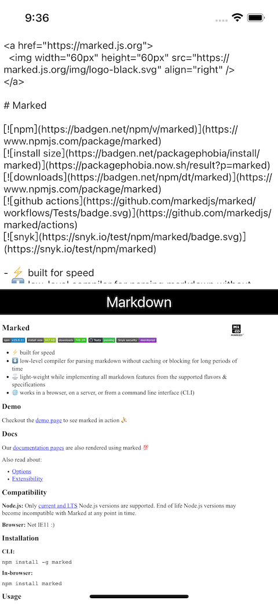

# WWJavaScriptContext+Markdown
[](https://developer.apple.com/swift/) [](https://developer.apple.com/swift/)  [](https://developer.apple.com/swift/) [](https://developer.apple.com/swift/)

[Use JavaScript to convert Markdown text.](https://github.com/showdownjs/showdown)

[使用JavaScript做Markdown的文字轉換。](https://cdnjs.cloudflare.com/ajax/libs/showdown/2.1.0/showdown.min.js)



### [Installation with Swift Package Manager](https://medium.com/彼得潘的-swift-ios-app-開發問題解答集/使用-spm-安裝第三方套件-xcode-11-新功能-2c4ffcf85b4b)
```js
dependencies: [
    .package(url: "https://github.com/William-Weng/WWJavaScriptContext_Markdown.git", .upToNextMajor(from: "1.0.0"))
]
```

### Example
```swift
import UIKit
import WebKit
import WWPrint
import WWJavaScriptContext
import WWJavaScriptContext_Markdown

final class ViewController: UIViewController {
    
    @IBOutlet weak var myTextView: UITextView!
    @IBOutlet weak var myWebView: WKWebView!
    
    override func viewDidLoad() {
        super.viewDidLoad()
    }
    
    @IBAction func convertHTML(_ sender: UIButton) {
        
        guard let text = myTextView.text,
              let htmlString = WWJavaScriptContext.Markdown.shared.convertHTML(source: text)
        else {
            return
        }
        
        wwPrint(htmlString)
        myWebView.loadHTMLString("\(htmlString)", baseURL: nil)
    }
}
```
